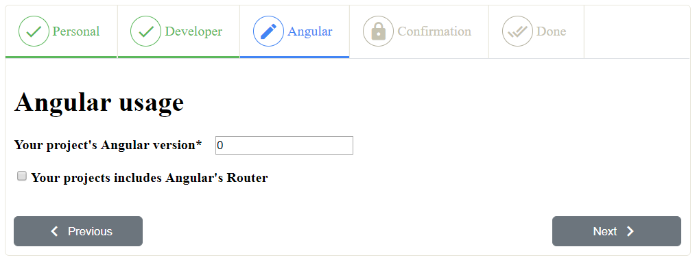
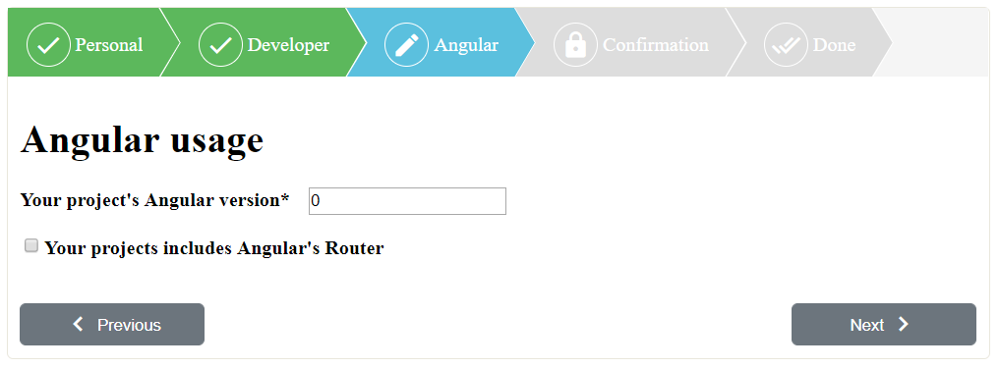
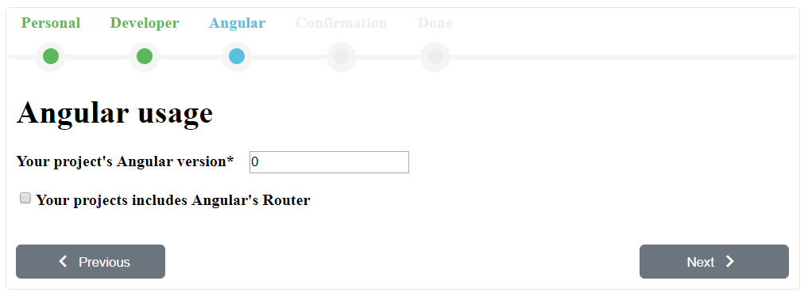

# NgWizard


The NgWizard component is a simple wizard/stepper component for
[Angular](https://angular.io) 9 utilizing
[Angular Routing](https://angular.io/guide/router) for navigation.

A demo can be found at
[https://cmdap.github.io/ng-wizard/](https://cmdap.github.io/ng-wizard/).

## Installation
1. The NgWizard component is available as an NPM package. To install the
   NgWizard package in your Angular project directory run:
    ```
    $ npm install @cmdap/ng-wizard
    ```
2. In your `app.module.ts` add `NgWizardModule` to your imports array.
   ```
   import { NgWizardModule } from '@cmdap/ng-wizard';
   
   @NgModule({
     declarations: [...],
     imports: [
       ...,
       NgWizardModule,
     ],
     providers: [...],
     bootstrap: [...]
   })
   ```

3. Then add a route for the `NgWizardComponent` to your Angular
    router configuration with each step in the wizard as a child route.

    For example, your `app-routing.module.ts` file for a wizard with 2 steps can look like this (import statements hidden):
    ```typescript
    import { NgWizardComponent } from '@cmdap/ng-wizard';

    const routes: Routes = [
      { path: '', component: NgWizardComponent, children: [
          { path: 'step-1', component: Step1Component },
          { path: 'step-2', component: Step2Component },
          { path: '**', redirectTo: 'step-1' },
      ], data: { name: 'myWizard' }},
      { path: '**', redirectTo: '' },
    ];
    
    @NgModule({
      imports: [RouterModule.forRoot(routes)],
      exports: [RouterModule]
    })
    export class AppRoutingModule { }
    ```

4. Finally, have your step components extend the `NgWizardStep` class or
    implement the `NgWizardStepInterface`.
    
    A minimal step component file can look like this:
    ```typescript
    import { Component } from '@angular/core';
    import { NgWizardStep } from '@cmdap/ng-wizard';
    
    @Component({
      selector: 'app-step1',
      templateUrl: './step1.component.html',
    })
    export class Step1Component extends NgWizardStep {
      constructor() {
        super();
      }
    }
    ```

5. If you want to use the NgWizard's default
    [Material icons](https://material.io/tools/icons) in your project you
    have to import the
    [material icons stylesheet](https://fonts.googleapis.com/icon?family=Material+Icons)
    in your project.  
    For example, add the following link to your `index.html`'s `<head>` tag.
    ```html
    <link href="https://fonts.googleapis.com/icon?family=Material+Icons" rel="stylesheet">
    ```


### Wizard options
Custom options can be passed to the NgWizard component via the `data` attribute of the wizard route.  
For example:
```typescript
const wizardConfig = {
  name: 'MyWizard',
  navBar: {
    icons: {
      previous: '<i class="material-icons ng-wizard-icon">cake</i>',
      current: '<i class="material-icons ng-wizard-icon">star</i>',
      next: '<i class="material-icons ng-wizard-icon">pool</i>',
    },
  },
};

const routes: Routes = [
  { path: '', component: NgWizardComponent, children: [], data: wizardConfig },
  { path: '**', redirectTo: '' },
];
```
The `name` option is the only mandatory option. Every wizard needs to have a unique `name` defined on its route.

Currently the supported configuration options which can be overwritten are (with their default values):
```typescript
{
  name: '',
  navBar: {
    icons: {
      previous: '<i class="material-icons ng-wizard-icon">done</i>',
      current: '<i class="material-icons ng-wizard-icon">create</i>',
      next: '<i class="material-icons ng-wizard-icon">lock</i>',
    },
  },
  buttons: {
    previous: {
      label: '<i class="material-icons ng-wizard-icon">chevron_left</i> Previous',
    },
    next: {
      label: 'Next <i class="material-icons ng-wizard-icon">chevron_right</i>',
    },
  }
}
```

### Wizard step options
Custom options for a specific step can be passed as the `data` attribute
of the corresponding child route.  
For example: 
```typescript
const doneStepOptions = {
  icon: '<i class="material-icons ng-wizard-icon">done_all</i>',
  buttons: {
    previous: {
      hidden: true,
    },
  },
  cleanQueryParameters: false,
  disableNavigation: true,
};

const routes: Routes = [
  { path: '', component: NgWizardComponent, children: [
      { path: 'done', component: Step5Component, data: doneStepOptions },
  ] },
];
```
Currently the supported step configuration options which can be
overwritten are: 
```typescript
{
  title: string; // By default a human readable version of the path is used
  icon: string; // This icon will be used for all stages of the step (previous/current/next)
  buttons: {
    previous: {
      label: string;
      hidden: boolean;
    };
    next: {
      label: string;
      hidden: boolean;
    };
  };
  cleanQueryParameters: boolean; // Remove all existing parameters present in the route
  disableNavigation: boolean; // Disables navigation from the wizard's navigation bar
}
```

### Hooks
Before navigating, the NgWizard component will call the active step's `wsOnNext` or `wsOnPrevious` method.
Use these methods to save the current state of the step to a service or to perform any other logic you want to execture before leaving the active step.

When a new step is displayed the `ngOnInit` method will be called by Angular.
Use this method to initialize the step's data and/or check the user's access rights to this step.

### Cancel navigation
If your step component's state is invalid return `false` from your
`wsIsValid` method. This will cancel the navigation to the next step but
will allow navigating to previous steps.

For any other reason you want to cancel the next or
previous navigation make sure your `wsOnNext` and/or `wsOnPrevious`
method returns `false`.  
This will cancel the Wizard's navigation.   

_Your step component is responsible for displaying an error message or
other reason why the navigation is cancelled._

### Entry via URL
Since the NgWizard component utilizes Angular's Routing it is possible
for a user to access any step in the wizard via the URL. If the user is not allowed to access a specific step you can check the
conditions and redirect the user in the step component's `ngOnInit`
method.

### Themes
The NgWizard component contains 3 themes you can use and extend, or you can write your own style rules.  
The themes are based on Dipu Raj's SmartWizard 4 themes and are called `default`, `arrows` and `dots`.  
Because this library uses Angular's style encapsulation you must import the theme or your style rules in the root `styles` file of your
Angular project.  

You can use one of the provided themes by importing it in your `styles.scss` file:
```
@import './node_modules/@cmdap/ng-wizard/themes/default';
```

**Default**  


**Arrows**  


**Dots**


*The provided themes are currently not optimized for responsive designs.*

## Changelog
### [10.0.0] - 2020-10-28
#### Added
- [BREAKING CHANGE] `name` field in `NgWizardOptions`. This field is mandatory for all NgWizard in your project. See [Wizard options](#Wizard-options)  


## Planned improvements
* Improve the responsiveness of the provided themes.
* Improve the component's Accessibility (ARIA attributes, colors and
  contrasts).
* Add support for more Angular versions
* Make the wizard step methods async
* Add an option to not push step navigation to the browser history
* Add support for setting the wizard's configuration programmatically

## Contributing
If you are willing to contribute to this project you can clone the source code from our [github repository](https://github.com/cmdap/ng-wizard).
```
$ git clone https://github.com/cmdap/ng-wizard.git
``` 
You will find a `src` folder containing the NgWizard demo project as seen on [https://cmdap.github.io/ng-wizard](https://cmdap.github.io/ng-wizard) as well as a `projects\ng-wizard` folder containing the source code for the ng-wizard component.

### Useful commands
In addition to the default Angular commands some useful NPM scripts have been added to the root `package.json` file.

| Useful command | Description |
| ------- | ----------- |
| `npm start` | Starts a development server for the **demo project**. The server will start on [http://localhost:4200](http://localhost:4200). |
| `ng build`| Builds the **demo project** to the `docs` folder. This folder will be published as the NgWizard's demo at [https://cmdap.github.io/ng-wizard](https://cmdap.github.io/ng-wizard). |
| `npm test` | Runs the Karma/Jasmine tests for the **ng-wizard component** with code coverage enabled. |
| `npm run lint` | Runs the linter on the **ng-wizard component**'s source code. |
| `npm run build` | Builds the **ng-wizard component**'s source code to an NPM package in the `dist\ng-wizard` folder. Also copies the `README.md` (with assets) and `LICENSE.txt` files as well as the ng-wizard's `themes` folder to that folder. |
| `npm publish dist\ng-wizard --access public` | **Only for project owners**. Publishes the **ng-wizard package** to the NPM repository at [https://www.npmjs.com/package/@cmdap/ng-wizard](https://www.npmjs.com/package/@cmdap/ng-wizard). |
